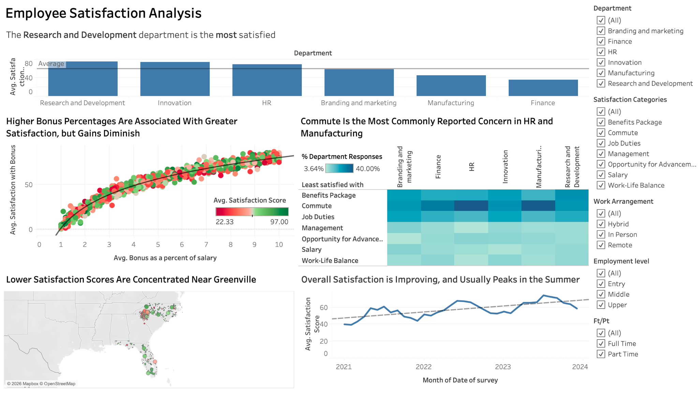

# Employee Satisfaction Analysis

An interactive Tableau analysis of synthetic employee survey data designed to identify differences in workplace satisfaction across departments, compensation levels, locations, and time.

## Business Questions

- Which departments report the highest and lowest average satisfaction?
- How is bonus percentage associated with satisfaction with bonuses?
- Which workplace concerns are most common within each department?
- Where are lower satisfaction scores geographically concentrated?
- How has overall satisfaction changed over time?

## Dataset

The analysis uses two related tables:

- **Employee:** 1,000 employee profiles containing department, employment, compensation, work arrangement, commute, and location attributes.
- **Satisfaction:** 3,711 survey responses from 984 employees, dated January 2021 through December 2023.

The dataset was obtained from Kaggle and is structured as a synthetic corporate employee-satisfaction dataset. The original dataset URL and redistribution license were not retained, so the separate source workbook is not republished here. The packaged Tableau workbook is also withheld from the public repository because it contains an embedded employee-level extract with IDs, ZIP codes, salaries, and other workforce attributes.

## Process

1. Reviewed the employee and satisfaction tables for completeness and consistent field types.
2. Joined survey responses to employee attributes using employee ID.
3. Validated record counts, date coverage, and department distributions.
4. Built interactive views for department comparisons, bonus satisfaction, reported concerns, geography, and time trends.
5. Normalized concern counts as a percentage of department responses so departments of different sizes could be compared fairly.
6. Added filters for department, satisfaction category, work arrangement, employment level, and full-time/part-time status.

More detail is available in [Methodology](docs/methodology.md) and the [Data Dictionary](docs/data-dictionary.md).

## Key Findings

- **Research and Development reported the highest average satisfaction score** at approximately 75.0, while Finance reported the lowest at approximately 35.8.
- **Bonus percentage and satisfaction with bonuses were strongly associated** (`r ≈ 0.92`), although the relationship flattened at higher bonus percentages.
- **Commute was the most commonly reported concern in HR and Manufacturing**, representing approximately 40.0% and 39.1% of their department responses, respectively.
- **Lower scores were concentrated near Greenville**, but this geographic pattern may partly reflect differences in the department composition of the local workforce.
- **Overall satisfaction increased from 2021 through 2023** and generally reached its highest levels during the summer.

## Recommendations

- Investigate the factors behind Finance's low overall satisfaction through a targeted pulse survey or employee listening sessions.
- Review commute-support options for HR and Manufacturing, such as flexible start times, transit assistance, or hybrid eligibility where operationally feasible.
- Evaluate bonus allocation in the midrange, where additional bonus percentage points correspond with larger satisfaction gains.
- Schedule engagement initiatives before the recurring summer increase and measure whether improvements persist into fall and winter.

## Limitations

- The data is synthetic, so findings demonstrate analytical technique rather than conclusions about a real employer.
- The analysis is descriptive and does not establish that bonuses, location, or season cause changes in satisfaction.
- Department sizes differ substantially; normalized percentages were used where raw counts would produce misleading comparisons.
- Zip-code patterns may be confounded by department, role, and work-arrangement differences.
- Sixteen employees did not submit a satisfaction response during the period.

## Tools

- Tableau: dashboard development, calculations, filters, trend analysis, and geographic visualization
- Excel: source-data review and preparation

## Project Files

- [Dashboard image](images/employee-satisfaction-dashboard.png)
- [Methodology](docs/methodology.md)
- [Data dictionary](docs/data-dictionary.md)
